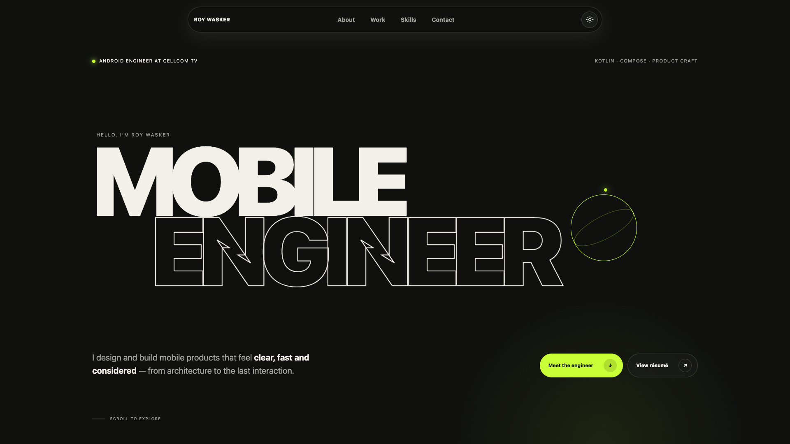
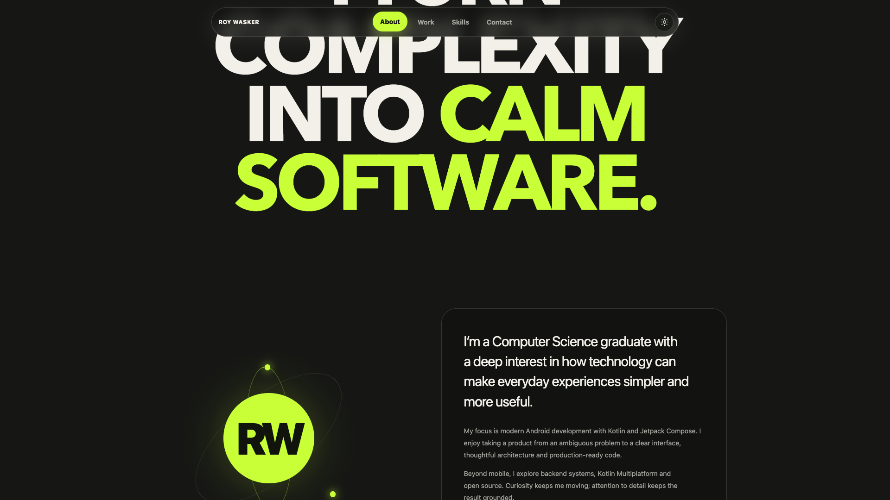
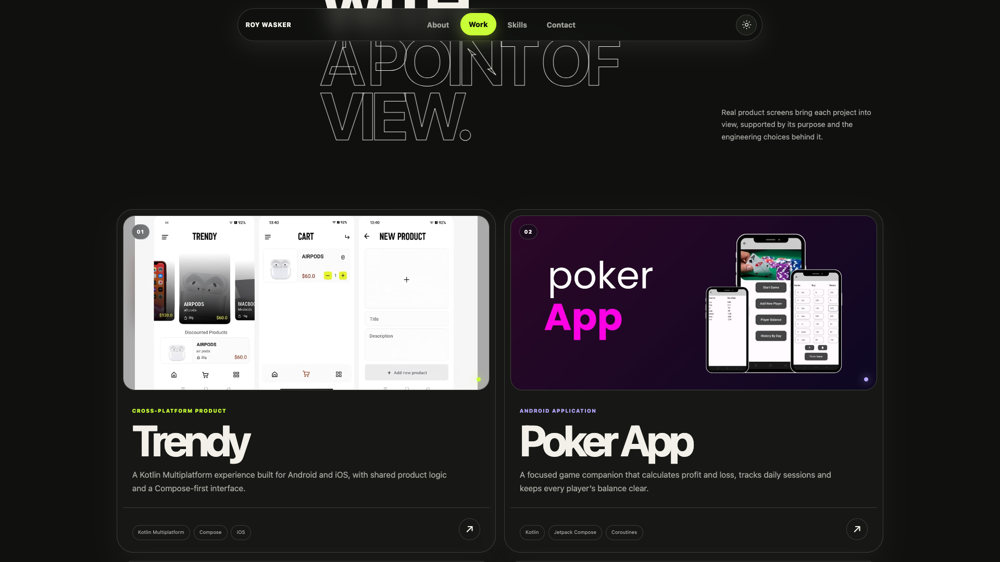
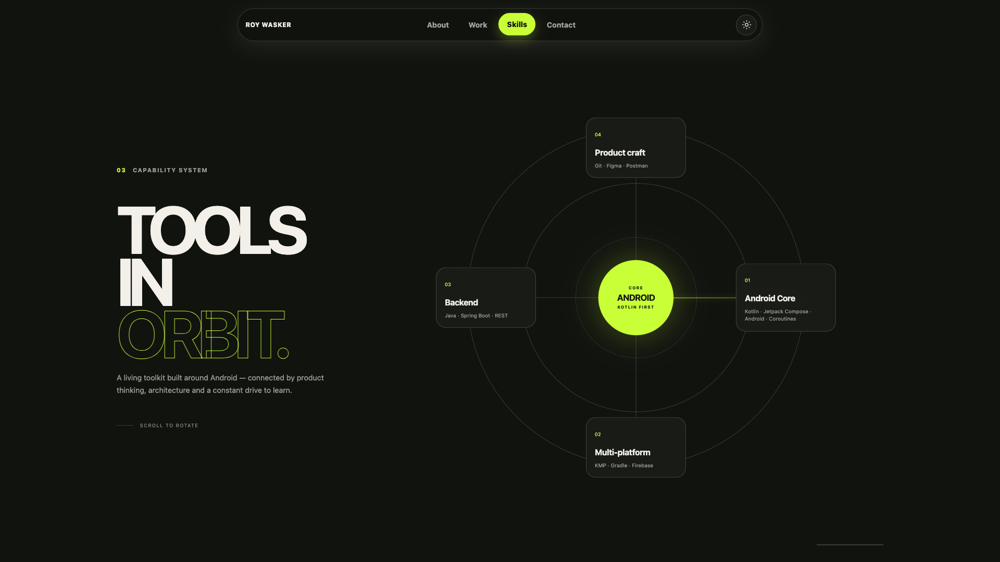

# Roy Wasker — Portfolio

A performance-first portfolio for Android Engineer **Roy Wasker**, built as a statically generated website with Astro and TypeScript.

The site presents Roy’s background, selected Android and backend projects, technical capabilities, social profiles and contact details through a responsive, accessible and motion-rich interface.

**Live site:** [roywasker.com](https://www.roywasker.com/)

## Preview

### Hero



### About and experience



### Selected projects



### Skills orbit



## Highlights

- Responsive layout designed for mobile, tablet, laptop and large desktop screens.
- Static Astro output with minimal client-side JavaScript.
- Dark and light themes with persisted user preference and system-theme fallback.
- Browser `theme-color` and `color-scheme` synchronization.
- Native CSS scroll-driven animations for the hero, reveal effects, About composition, page progress and Skills orbit.
- Progressive animation fallback for browsers without scroll-timeline support.
- Automatic active-section highlighting in desktop and mobile navigation.
- Accessible mobile navigation with Escape handling, focus restoration and outside-click dismissal.
- Project posters built from real product screens and delivered as optimized raster AVIF assets.
- Responsive project images using `srcset`, explicit dimensions, lazy loading and asynchronous decoding.
- Raster Open Graph artwork at 1200×630 for reliable social sharing.
- Automated responsive, accessibility and Lighthouse quality gates.

## Technology stack

| Area | Technology | Purpose |
| --- | --- | --- |
| Framework | Astro 7 | Static rendering, component composition and optimized production output |
| Language | TypeScript 6 | Type-safe content, components, browser behavior and QA tooling |
| UI | Astro components + semantic HTML | Server-rendered, framework-free interface |
| Styling | Native CSS | Design tokens, responsive layout, themes, transitions and component styling |
| Motion | CSS Scroll-Driven Animations | Compositor-friendly scroll progress and reveal effects |
| Browser behavior | Minimal native JavaScript | Theme persistence, menu behavior and active-section observation |
| End-to-end QA | Playwright | Multi-viewport browser tests and interaction verification |
| Accessibility QA | Axe for Playwright | Automated WCAG A and AA validation in dark and light themes |
| Performance QA | Lighthouse 13 | Performance, accessibility, best-practice and SEO budgets |
| Deployment | GitHub Actions + GitHub Pages | Quality-gated static deployment |

No React runtime, state-management library or third-party animation framework is shipped to the browser.

## Architecture

The production website is generated from `src/`:

- `src/pages/index.astro` assembles the single-page portfolio.
- `src/layouts/BaseLayout.astro` owns document metadata, structured data, theme initialization and shared browser behavior.
- `src/components/` contains the header, project cards, skills experience and footer.
- `src/data/portfolio.ts` is the central source for profile, navigation, project and skill content.
- `src/styles/global.css` contains shared tokens, layout rules, motion timelines and responsive behavior.

Astro produces compressed static HTML in `dist/`. Styles are inlined by the build, while the small amount of browser logic is bundled by Astro.

The repository also retains the original Kotlin/Kobweb implementation under `site/` as historical reference. It is not part of the active Astro production build.

## Project structure

```text
.
├── .github/workflows/
│   ├── deploy.yml              # Quality-gated GitHub Pages deployment
│   └── qa.yml                  # Pull-request QA workflow
├── image/                      # Current README screenshots
├── public/
│   ├── images/projects/        # Responsive AVIF project posters
│   ├── favicon.svg
│   ├── robots.txt
│   ├── sitemap.xml
│   └── social-card.png         # 1200×630 Open Graph image
├── scripts/
│   ├── capture-screenshots.mjs # Deterministic README screenshot capture
│   └── lighthouse.mjs          # Lighthouse runner and quality budgets
├── src/
│   ├── components/
│   ├── data/portfolio.ts
│   ├── layouts/BaseLayout.astro
│   ├── pages/index.astro
│   └── styles/global.css
├── tests/portfolio.spec.ts
├── astro.config.mjs
├── playwright.config.ts
├── package.json
└── tsconfig.json
```

## Design and interaction

### Responsive layout

The design uses fluid type, constrained content shells, CSS Grid and targeted breakpoints. Project cards use a two-column grid on wider screens and a single-column flow on mobile. The Skills experience switches from a scroll-controlled orbit to a compact card grid on narrow or low-height screens.

Automated browser coverage includes these representative viewports:

- 320×568 — compact mobile
- 390×844 — modern mobile
- 820×1180 — tablet
- 1440×900 — desktop

### Theme system

Theme tokens are defined as CSS custom properties. On first visit, the site follows `prefers-color-scheme`; a manual selection is persisted in `localStorage`. Theme changes also update the browser chrome through `meta[name="theme-color"]` and the root `color-scheme` property.

Light mode separates surface blue from text blue so the palette remains visually light while text continues to meet WCAG contrast requirements.

### Motion

Continuous scroll effects use native CSS animation timelines instead of per-frame JavaScript layout calculations. This covers:

- Page progress indicator
- Hero title movement and fading
- About background word, rings and signal nodes
- Section and project reveals
- Skills radar, satellites, scan line and progress

`prefers-reduced-motion` disables non-essential motion. Browsers without CSS scroll timelines receive a lightweight `IntersectionObserver` reveal fallback.

## Performance strategy

- Static HTML output with compressed markup.
- Always-inlined component CSS to avoid render-blocking stylesheet requests.
- System font stack with no external font request.
- Minimal client-side JavaScript and no hydrated UI framework.
- AVIF project posters with 640px and 1280px responsive candidates.
- Lazy loading and asynchronous decoding for below-the-fold project images.
- Explicit image dimensions to prevent layout shifts.
- Local Lighthouse budgets for Core Web Vitals and total transfer size.


## Accessibility

- Semantic headings, sections, navigation and articles.
- Skip link for keyboard users.
- Visible `:focus-visible` treatment.
- Accessible theme and mobile-menu labels.
- Focus restoration when the mobile menu closes with Escape.
- `aria-current` for the section currently visible in the viewport.
- Descriptive hidden text for links that open a new browser tab.
- Touch-friendly interactive targets.
- Full automated WCAG A/AA scans in both dark and light themes.
- Reduced-motion support.

Automated checks are an additional safety net and do not replace manual keyboard and screen-reader testing.


## Contact

- Website: [roywasker.com](https://www.roywasker.com/)
- GitHub: [github.com/roywasker](https://github.com/roywasker)
- LinkedIn: [Roy Wasker](https://www.linkedin.com/in/roy-wasker/)
- Medium: [@royx520](https://medium.com/@royx520)
