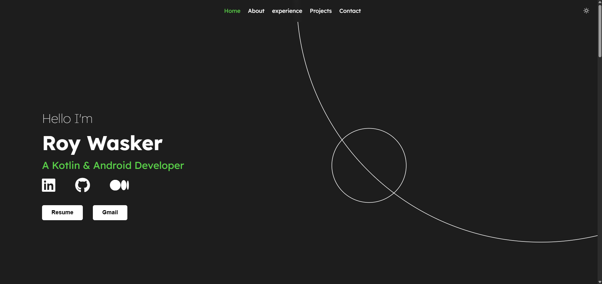

## Portfolio Website
Welcome to my personal web portfolio! This project showcases who I am as a developer, highlights selected projects I've built, and provides an easy way to connect with me professionally.

## Features

- **Minimal Design:** Keep it simple, yet elegant, to highlight your work.
- **Responsive:** Ensures a seamless experience across various devices.
- **Kotlin Multi-Platform:** Leverages the power of Kotlin for both front-end and back-end development.


## Tech Stack

- **[Kobweb](https://github.com/varabyte/kobweb):** Compose HTML framework for Kotlin multi-platform.
- **[Jetpack Compose](https://developer.android.com/jetpack/compose):** Modern Android UI toolkit for building native UIs in a declarative way.
- **[Kotlin](https://kotlinlang.org/):** Modern programming language for concise and expressive code.

## Previews:




## Getting Started
Follow these steps to set up portfolio locally:

### 1. Clone the repository:

```bash
$ git clone https://github.com/roywasker/Portfolio.git
```

### 2. Getting Started

First, run the development server by typing the following command in a terminal under the `site` folder:

```bash
$ cd site
$ kobweb run
```

Open [http://localhost:8080](http://localhost:8080) with your browser to see the result.

You can use any editor you want for the project, but we recommend using **IntelliJ IDEA Community Edition** downloaded
using the [Toolbox App](https://www.jetbrains.com/toolbox-app/).

Press `Q` in the terminal to gracefully stop the server.